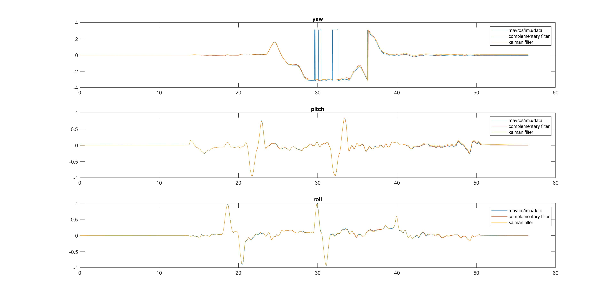

In this assignment, I implemented two versions of state estimation.

## 1. State estimation using IMU information

The estimated state is defined as [pitch, roll]. 

The implemented algorithms are in the "algos_roll_and_pitch" folder, including:

- complementary_filter
- kalman_filter

The references are:

1. IMU Attitude Estimation: https://philsal.co.uk/projects/imu-attitude-estimation
2. Sensor Fusion: [Part 1](https://www.youtube.com/watch?v=RZd6XDx5VXo), [Part 2](https://www.youtube.com/watch?v=BUW2OdAtzBw), [Part 3](https://www.youtube.com/watch?v=hQUkiC5o0JI)

The results:

## 2. State estimaton using both IMU and Magnetometer Information

The estimated state is defined as a 4-dim quaternion vector. 

The implemented algorithms are in the "algos_quaternion" folder, including:

* complementary_filter
* kalman_filter
* extended_kalman_filter

The references are:

* Bachmann, Eric R., et al. "[Inertial and magnetic posture tracking for inserting humans into networked virtual environments](https://calhoun.nps.edu/handle/10945/41586)." *Proceedings of the ACM symposium on Virtual reality software and technology*. 2001.

* Deibe, Álvaro, et al. "[A Kalman Filter for nonlinear attitude estimation using time variable matrices and quaternions](https://www.mdpi.com/1424-8220/20/23/6731)." *Sensors* 20.23 (2020): 6731.
* Philip M. Salmony, "[Quaternion-Based ExtendedKalman Filter for Fixed-WingUAV Attitude Estimation](http://philsal.co.uk/wp-content/uploads/2019/10/EKF_FixedWing-1.pdf)", 2019.

The results:

## Matlab's estimation function

I also tested Matlab's [estimation functions](https://www.mathworks.com/help/fusion/ug/introduction-on-choosing-inertial-sensor-fusion-filters.html).

The results:

